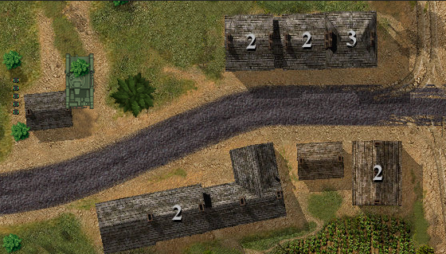
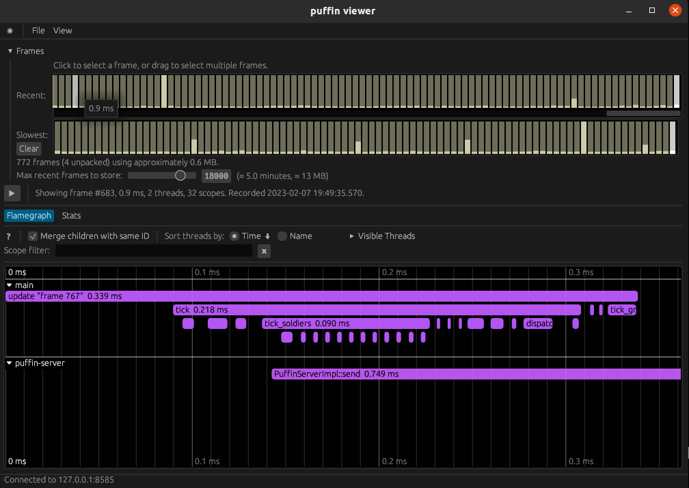

# OpenCombat

Open source close combat inspired game. Presentation available [here](http://www.closecombatseries.net/CCS/modules.php?name=Forums&file=viewtopic&t=11696)

## Development

### Requirements

To be able to compile, please install (Debian packages example)

    build-essential cmake pkg-config libasound2-dev libfontconfig-dev libudev-dev libzmq3-dev

### Run

Add `--release` after `--bin battle_server` or after `--bin battle_gui` to disable debug and have normal performances.

#### Standalone server

    cargo run --bin battle_server --release -- Demo1 --rep-address tcp://0.0.0.0:4255 --bind-address tcp://0.0.0.0:4256

#### Standalone gui

Server must already been started

    cargo run --bin battle_gui --release -- Demo1 assets/demo1_deployment.json --server-rep-address tcp://0.0.0.0:4255 --server-bind-address tcp://0.0.0.0:4256 --side a --side-a-control N --side-a-control NW --side-a-control W --side-b-control ALL

#### Gui with embedded server

    cargo run --bin battle_gui --release -- Demo1 assets/demo1_deployment.json --embedded-server --server-rep-address tcp://0.0.0.0:4255 --server-bind-address tcp://0.0.0.0:4256 --side a --side-a-control N --side-a-control NW --side-a-control W --side-b-control ALL

### Profile

Install [puffin_viewer](https://github.com/EmbarkStudios/puffin/tree/main/puffin_viewer) :

    cargo install puffin_viewer

Start server or client with `--profile` flag. Example :

    cargo run --bin battle_server -- --server-rep-address tcp://0.0.0.0:4255 --server-bind-address tcp://0.0.0.0:4256 --profile

Start puffin viewer :

    puffin_viewer --url 127.0.0.1:8585

Output will be like :

