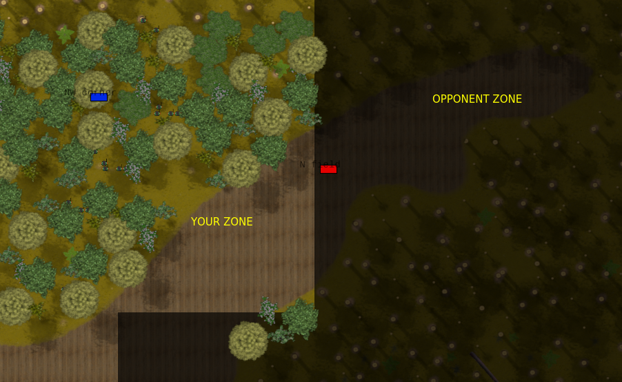
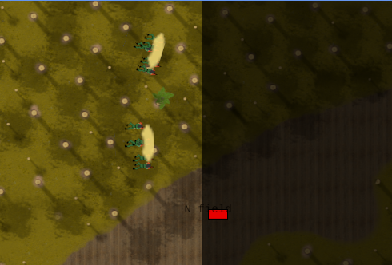
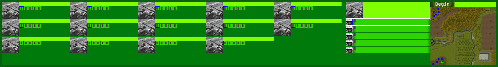
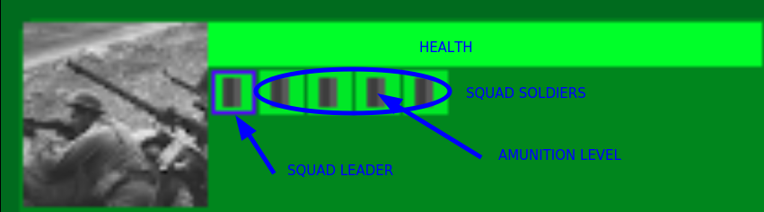
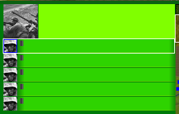
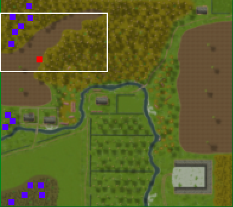
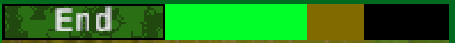
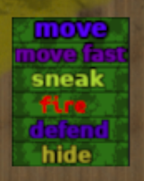
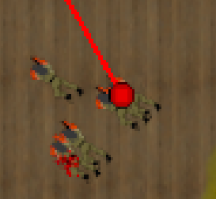
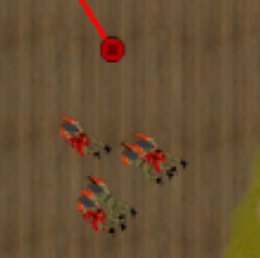

# Player manual

Open Combat is a real-time tactical war game. Your objective is to win battles in a theater of war. You will manage soldiers, vehicle and artillery moves and fire orders. And only that.

## Battle

### Deployment phase

This phase let you all time you need to place your troops. You must think about two things:

- Your soldiers are they in secured place ? Avoid places where they can be shoot when battle will start
- Your soldiers will be able to make tactical move to conquer the map ?

You can place them in the lighted area. Dark area is the opponent placement zone.

💡 *Note*: You can hide trees with `T` key.

#### How place the troops

To move troops, drag'n drop soldiers with the `left-click`.

#### Prepare some orders

You can give orders to squads. See following [Orders section](#orders). These orders will be executed only when battle start.

💡 *Note*: Unless you want your squad move/sneak immediately when battle start, choose `Hide` order is a good choice to prevent your soldiers from being seen at the start of the battle.

### HUD

#### Squad list

This is the list of your squads. You can quick see how are they health (green is ok, red is not ok ...). Little icon is ammunition level.

A click on the squad detail selected it. A second click center map on the squad leader.

#### Squad detail

This is a larger view of squad detail. You can see on each soldier line his current behavior.

#### Minimap

Minimap is a reduced image of the entire map. Your squad are blue square. Visible opponents squad are red square.

You can click on the minimap to center screen on clicked point.

#### Morale

The color bar is split in two zone: Left is side "A" (you), right is side "B" (opponent). Green is good morale. Dark green is bad morale.

#### Start the battle

When you are ready to start the battle, click on the "Begin" button.

### Fight phase

#### How to win

Two possible ways:

- Reduce opponent morale to a very low state by killing or injuring their soldiers
- Take all flags on the map

#### Tactics

- When soldier walk, he is more visible
- When soldier run, he is more (more) visible
- When soldier is crawling, he is less visible
- When soldier firing, he is more visible
- When soldier receive fire, he can be pinned down and be unable to fire
- When soldier pinned down, he can refuse a move order
- When soldier pinned down, he can't refuse a move fast order, but will do it by crawling
- When soldier is near a wall/trunk/etc. he got protection from it
- When a soldier shoots at a soldier near a wall/trunk/etc., it will be difficult to hit him

#### Orders

To open orders menu, press `right-click` when one or multiple squads are selected.

* Move: Move by walking
* Move fast: Move by running
* Sneak: Move by crawling
* Fire: Shoot on the given target
* Defend: Shoot on all visible opponents
* Hide: Hide and shoot only if opponent is very near (yellow circle when giving order)

##### Fire

When giving fire order, two possible cases :

When circle is red filled, you give an target order. The squad will target the opponent squad soldiers.

When circle is black filled, you give a suppress fire order. The squad will fire "on the ground" to make a suppress fire.